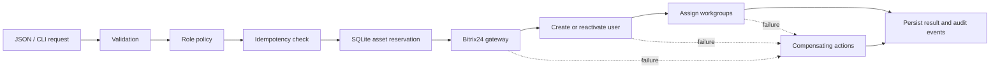

# StoneTree IT Operations Automation Demo

[](https://github.com/ShapkaWhite-1/stonetree-it-automation-demo/actions/workflows/tests.yml)

**Автор:** Александр Белошапка — CRM & IT Automation Specialist, Dubai, UAE.

Демонстрационный Python-проект для позиции IT Specialist в StoneTree Holding. Он автоматизирует onboarding и offboarding сотрудников, взаимодействует с Bitrix24 через REST API, учитывает выданное оборудование в SQLite и сохраняет подробный журнал каждого шага.

Главная цель проекта — показать не объём кода, а логику: безопасный порядок операций, повторяемость, обработку частичных ошибок и возможность сопровождать решение в реальной IT-инфраструктуре.

## Что решает проект

Onboarding:

1. Проверяет входные данные сотрудника.
2. Определяет отдел, рабочие группы и оборудование по ролевой политике.
3. Проверяет уникальный `request_id`, чтобы повторный запрос не создал второго пользователя.
4. Резервирует доступное оборудование в транзакции SQLite.
5. Ищет сотрудника в Bitrix24 по email.
6. Создаёт пользователя или активирует существующего.
7. Добавляет пользователя в нужные рабочие группы.
8. Фиксирует результат и каждый шаг в audit log.

Если внешний вызов завершается ошибкой, запускаются компенсирующие действия: добавленные группы удаляются, созданный аккаунт блокируется, новое оборудование возвращается в доступный пул.

Offboarding выполняется в security-first порядке: сначала блокируется аккаунт, затем удаляются рабочие группы и освобождается оборудование. Ошибка одного шага не останавливает остальные действия, а итог помечается как `partial` для ручной проверки.

## Архитектура



Код разделён на независимые слои:

- `models.py` — типизированные доменные модели и проверка данных.
- `policy.py` — ролевые политики доступов и оборудования.
- `gateway.py` — реальный REST-клиент Bitrix24 и детерминированный fake для тестов.
- `repository.py` — SQL-схема, транзакции, журнал операций и учёт активов.
- `service.py` — бизнес-логика onboarding/offboarding и компенсации.
- `cli.py` — интерфейс запуска без привязки к web-фреймворку.
- `tests/` — проверки ключевых и аварийных сценариев.
- `ops/` — пример безопасного развёртывания и сопровождения в Linux: systemd, права доступа, логи, резервное копирование, DNS/SSL и диагностика nginx.

## Быстрый запуск

Требуется Python 3.11 или новее. Внешние библиотеки не нужны.

```bash
python main.py demo
```

Команда выполняет полностью безопасный offline-сценарий через `FakeBitrixGateway` и выводит структурированный JSON со всеми шагами.

Запуск тестов:

```bash
python -m unittest discover -s tests -v
```

Проверяется:

- успешный onboarding;
- идемпотентный повтор запроса;
- нехватка оборудования до внешних side effects;
- откат после ошибки назначения группы;
- security-first offboarding;
- продолжение очистки после частичной ошибки;
- валидация email;
- формирование REST-запроса и retry при временной ошибке Bitrix24.

## Linux и серверная инфраструктура

Проект является CLI-инструментом и не открывает сетевой порт, поэтому для текущей версии nginx и SSL не требуются. Это уменьшает поверхность атаки. Для эксплуатации подготовлены:

- [Linux runbook](ops/README.md) с установкой через SSH, правами доступа и командами диагностики;
- [systemd unit](ops/stonetree-it-smoke-test.service) для контролируемого запуска от непривилегированного пользователя;
- [backup script](ops/backup-audit-db.sh), а также [service](ops/stonetree-it-backup.service) и [timer](ops/stonetree-it-backup.timer) для резервного копирования SQLite;
- [nginx/SSL template](ops/nginx-api.conf.example) для будущего внутреннего HTTP API. Шаблон намеренно не подключён к текущему CLI.

Runbook отдельно описывает проверку DNS, TLS-сертификата, прослушиваемых портов, журналов systemd и порядок диагностики `502 Bad Gateway`.

## Запуск с реальным Bitrix24

Сначала замените демонстрационные ID в `examples/access_policy.json` на реальные ID отделов и рабочих групп. Затем передайте webhook через переменную окружения — токен не должен храниться в репозитории.

PowerShell:

```powershell
$env:BITRIX_WEBHOOK_URL="https://company.bitrix24.com/rest/USER_ID/WEBHOOK_TOKEN/"
python main.py onboard --employee examples/employee.json --request-id onboarding-ST-IT-042
```

Без реальных вызовов:

```bash
python main.py --dry-run onboard --employee examples/employee.json --request-id test-001
```

Offboarding:

```bash
python main.py offboard --employee examples/employee.json --request-id offboarding-ST-IT-042
```

Webhook должен принадлежать администратору и иметь только необходимые права. Реальный адрес webhook нельзя выводить в логи, передавать в исходном коде или коммитить в Git.

## Ключевые инженерные решения

### 1. Идемпотентность

`request_id` — первичный ключ операции. Повтор того же запроса возвращает сохранённый результат и не вызывает Bitrix24 второй раз. Это защищает от повторных кликов, retry со стороны очереди и сетевых таймаутов.

### 2. Saga вместо ложной «общей транзакции»

SQLite и Bitrix24 невозможно объединить одной ACID-транзакцией. Поэтому workflow хранит выполненные шаги и запускает обратные действия при сбое внешнего API.

### 3. Preflight до внешних изменений

Оборудование резервируется до создания аккаунта. Если ноутбука или SIM-карты нет, Bitrix24 не вызывается и в корпоративных системах не остаётся лишних сущностей.

### 4. Dependency inversion

Бизнес-логика зависит от протокола `BitrixGateway`, а не от HTTP. Благодаря этому тесты не используют сеть и могут точно воспроизводить ошибки на конкретном шаге.

### 5. Ограниченные retry

REST-клиент повторяет только временные ошибки (`429`, `502`, `503`, `504`, `QUERY_LIMIT_EXCEEDED`) с exponential backoff. Бизнес-ошибки не маскируются бесконечными повторами.

### 6. Аудит

Таблицы `operations` и `events` позволяют ответить, кто и с каким `request_id` запускал процесс, какие шаги прошли и где возникла ошибка. Это основа для dashboard, алертов и расследования инцидентов.

## Что я бы добавил для production

- OAuth или secret manager вместо входящего webhook для сложной интеграции.
- RBAC на запуск workflow и обязательное подтверждение менеджера.
- Очередь задач с блокировкой зависших операций и controlled retry.
- Метрики, structured logs, correlation ID и алерты в monitoring-систему.
- Реальную CMDB/asset-систему вместо локальной SQLite.
- Интеграции с Google Workspace/Microsoft 365, телефонией, VPN и MDM.
- Проверку подписи входящих webhooks и шифрование чувствительных данных.
- Внутренний API-слой за nginx, Docker Compose и deployment pipeline.

## Официальная документация Bitrix24

- [`user.add`](https://apidocs.bitrix24.com/api-reference/user/user-add.html)
- [`user.get`](https://apidocs.bitrix24.com/api-reference/user/user-get.html)
- [`user.update`](https://apidocs.bitrix24.com/api-reference/user/user-update.html)
- [`sonet_group.user.add`](https://apidocs.bitrix24.com/api-reference/sonet-group/members/sonet-group-user-add.html)
- [`sonet_group.user.delete`](https://apidocs.bitrix24.com/api-reference/sonet-group/members/sonet-group-user-delete.html)

## Важное замечание

ID отделов и групп в примере вымышлены. Проект по умолчанию работает offline и не выполняет реальные действия без явного webhook URL.

